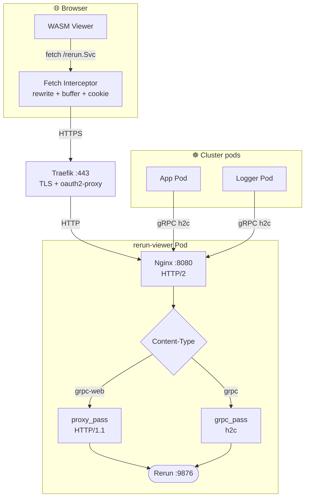
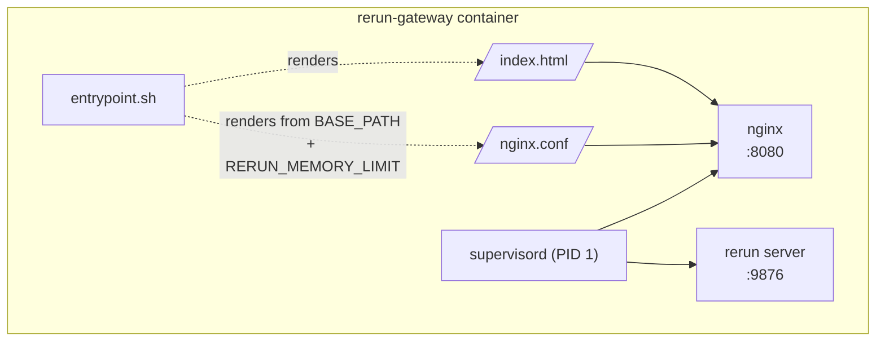

# Rerun Gateway

Deploy [Rerun](https://rerun.io) as a Wandelbots App on a service manager cluster. Provides a shared visualization server that any pod in the cluster can log data to via gRPC, with a web viewer accessible through the platform dashboard.

## Problem

The App CRD routes traffic at `/<cell>/<app-name>/*`. Rerun's WASM viewer sends gRPC-web requests to the host root (`/rerun.Service/Method`), which falls outside the allowed path. Additionally:

- Nginx's default 1MB request body limit silently drops gRPC WriteMessages from the SDK
- Browsers require credentials and stream buffering for requests through oauth2-proxy

## Solution

- **Fetch interceptor**: a custom `index.html` rewrites gRPC-web URLs to the app's base path, buffers ReadableStream bodies (Safari/Chrome compatibility), and injects auth credentials
- **Nginx**: dual-protocol proxy — gRPC-web (HTTP/1.1) for browsers via `proxy_pass`, native gRPC (HTTP/2) for SDK clients via `grpc_pass`, with unlimited request body size
- **Supervisord**: manages both nginx and the rerun server process within a single container

## Architecture

End-to-end request flow for both browser (gRPC-web) and native SDK (gRPC/h2c) clients:



Container layout inside the `rerun-viewer` pod (single container, supervised processes):



## Deploy

### 1. Build and push image (manual)

Images must be built for `linux/amd64` and use unique version tags (the cluster does not re-pull the same tag):

```bash
az acr login --name wandelbots
docker buildx build --platform linux/amd64 \
  -t wandelbots.azurecr.io/nova-apps/rerun-gateway:1.0.6 \
  --push ./rerun-viewer/
```

### 1b. Build via CI (automatic)

On merge to `main`, semantic-release creates a version tag automatically based on conventional commits.

CI will build the image and publish `wandelbots.azurecr.io/nova-apps/rerun-gateway:<version>`.

### 2. Deploy via API

Use the **v2 API** (snake_case fields, supports `resources.memory_limit`):

```bash
curl -s -X POST "https://<INSTANCE_HOST>/api/v2/cells/cell/apps" \
  -H "Content-Type: application/json" \
  -H "Cookie: _oauth2_proxy=<AUTH_COOKIE>" \
  -d '{
    "name": "rerun-viewer",
    "app_icon": "app-icon.png",
    "container_image": {
      "image": "wandelbots.azurecr.io/nova-apps/rerun-gateway:1.0.6",
      "secrets": [{"name": "pull-secret-wandelbots-azurecr-io"}]
    },
    "environment": [
      {"name": "RERUN_MEMORY_LIMIT", "value": "500MB"}
    ],
    "resources": {
      "memory_limit": "2000Mi"
    },
    "port": 8080
  }'
```

### 4. Delete the app

```bash
curl -s -X DELETE "https://<INSTANCE_HOST>/api/v2/cells/cell/apps/rerun-viewer" \
  -H "Cookie: _oauth2_proxy=<AUTH_COOKIE>"
```

## Access

### Web viewer

```
https://<INSTANCE_HOST>/cell/rerun-viewer/
```

The viewer auto-connects to the rerun server via gRPC-web. Data appears as soon as any logger starts sending.

### From cluster pods (recommended)

Use the short service name (no FQDN needed within the same namespace):

```python
import rerun as rr
rr.init("my_recording", spawn=False)
rr.connect_grpc("rerun+http://app-rerun-viewer:8080/proxy")
rr.log("world/points", rr.Points3D([[1, 2, 3]]))
```

Multiple loggers can connect simultaneously — each creates a separate recording in the viewer.

### Native viewer (from your machine)

Requires kubectl access. Traefik downgrades backend traffic to HTTP/1.1 by
default, which breaks native gRPC. A one-time service annotation is needed to
enable HTTP/2 (h2c) passthrough. Without kubectl, use the web viewer.

```bash
# One-time: enable h2c on the service (requires kubectl)
kubectl annotate service app-rerun-viewer -n <cell-namespace> \
  "traefik.ingress.kubernetes.io/service.serversscheme=h2c"

# Run the local proxy
brew install nginx
./rerun-viewer/local-proxy.sh <INSTANCE_HOST>
# Then: rerun +http://127.0.0.1:9876/proxy
```

### Test logger app

Deploy a test app that continuously logs random 3D points:

```bash
curl -s -X POST "https://<INSTANCE_HOST>/api/v2/cells/cell/apps" \
  -H "Content-Type: application/json" \
  -H "Cookie: _oauth2_proxy=<AUTH_COOKIE>" \
  -d '{
    "name": "rerun-logger",
    "app_icon": "app-icon.png",
    "container_image": {
      "image": "wandelbots.azurecr.io/nova-apps/rerun-logger:1.0.5",
      "secrets": [{"name": "pull-secret-wandelbots-azurecr-io"}]
    },
    "environment": [],
    "port": 8080
  }'
```

## Limitations

### Web viewer requires HTTPS (secure context)

The fetch interceptor relies on Service Worker / modern `fetch` + `ReadableStream` APIs, which browsers only expose in a [secure context](https://developer.mozilla.org/en-US/docs/Web/Security/Secure_Contexts). Loading the viewer over plain HTTP — or over HTTPS with an untrusted certificate that the user has only click-through accepted — disables the interceptor, so gRPC-web requests go out unmodified to `/rerun.Service/*` and are 404'd by the ingress.

This matters in environments where the instance host is fronted by an enterprise TLS-terminating proxy (MITM) using an internal CA:

- **Corporate-managed machines** — the CA is in the system trust store, the browser treats the page as fully secure, the interceptor runs. No action needed.
- **BYO / unmanaged machines** — the browser shows a cert warning. Clicking "Proceed anyway" loads the page but marks the origin as **non-secure**, and the interceptor is silently disabled.

Workarounds:

1. **Install the corporate root CA** into the OS / browser trust store. This is the only fix that makes the viewer work normally.
2. **Launch the browser with cert checks disabled** (dev-only, single session):

   ```bash
   # Chrome / Chromium
   google-chrome --ignore-certificate-errors --user-data-dir=/tmp/rerun-insecure

   # Firefox: about:config → security.enterprise_roots.enabled = true (after importing CA)
   ```

   With `--ignore-certificate-errors` Chrome treats the origin as secure, so the interceptor runs.
3. **Use the native viewer via the local h2c proxy** — bypasses the browser entirely (see [Native viewer](#native-viewer-from-your-machine)).

### Other constraints

- **gRPC-web only in the browser** — HTTP/2 trailers are not exposed to JS, so the WASM viewer must go through nginx's `proxy_pass` translation. Native gRPC from the browser is not possible.
- **Traefik downgrades to HTTP/1.1 by default** — the `traefik.ingress.kubernetes.io/service.serversscheme=h2c` annotation on the service is mandatory for native SDK clients going through the ingress.
- **Single-replica viewer** — Rerun stores recordings in process memory; scaling beyond one replica would split recordings across pods. Use `RERUN_MEMORY_LIMIT` to bound retention instead.
- **No persistence** — restarting the pod drops all recordings.

## Configuration

| Environment Variable | Default | Description |
|---------------------|---------|-------------|
| `BASE_PATH` | `/cell/rerun-viewer` | Set automatically by the App CRD operator |
| `RERUN_MEMORY_LIMIT` | `500MB` | Max memory for stored data (oldest dropped when exceeded). Pod `memory_limit` should be at least 3.3× this value due to fragmentation overhead. |

## File Structure

```
.gitlab-ci.yml            # CI pipeline: build, lint, publish
rerun-viewer/
  Dockerfile              # python:3.11-slim + nginx + supervisor + rerun-sdk 0.33.0
  entrypoint.sh           # Generates configs from BASE_PATH/RERUN_MEMORY_LIMIT env
  nginx.conf.template     # Dual-protocol proxy (gRPC-web + native gRPC)
  index.html.template     # Viewer page with fetch interceptor
  supervisord.conf        # Manages nginx + rerun processes
  app.yaml                # App CRD manifest (alternative to API deploy)
  local-proxy.sh          # Local nginx wrapper for native viewer access
rerun-logger-test/
  Dockerfile              # Test logger image
  logger.py               # Logs random 3D points to rerun-viewer
  app.yaml                # App CRD manifest
```
